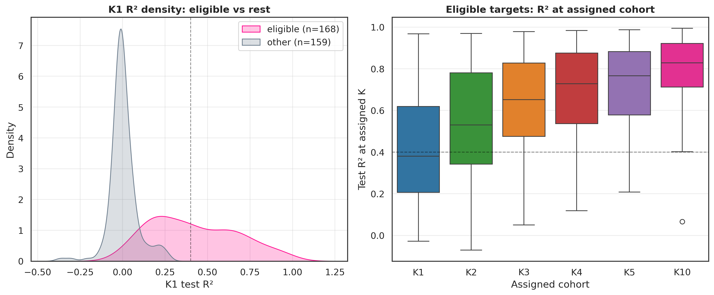
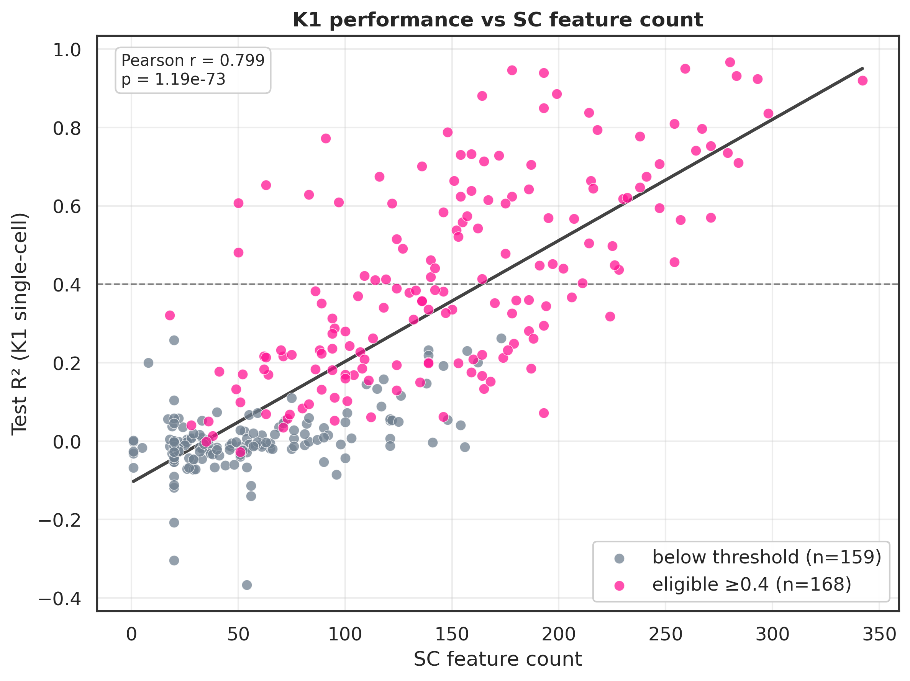
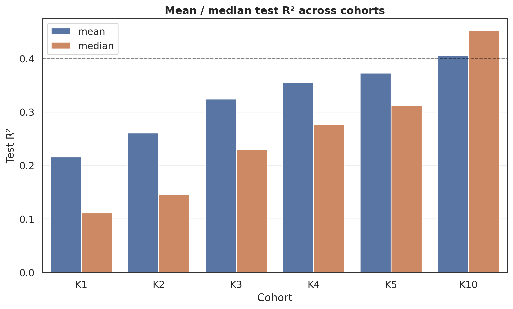

Model selection and target filtering

Model performance was evaluated across 327 target miRNAs. Only targets that achieved at least a minimal predictive performance threshold (R² > 0.4) at any pseudobulk resolution (K = 1, 2–5, 10) or on bulk-level metrics were retained for downstream analysis. In total, 164 miRNAs passed this criterion and were defined as eligible targets.

Selection of optimal pseudobulk resolution

Across all evaluated targets, predictive performance generally improved with increasing pseudobulk aggregation level. However, for a subset of miRNAs, the difference between single-cell resolution (K = 1) and higher pseudobulk levels was marginal.

To balance predictive performance and resolution granularity, an adaptive strategy for selecting the optimal pseudobulk level was implemented (see vizualization_and_config.ipynb). For each eligible target, the maximum R² across all K values was first identified. A tolerance threshold of 7.5% relative decrease from this maximum was then applied, and the smallest K satisfying this criterion was selected as the final prediction resolution.

Distribution of selected targets

The final assignment of optimal resolution across eligible miRNAs was as follows:

K1 (single-cell level): 11 targets
K2: 21 targets
K3: 18 targets
K4: 20 targets
K5: 22 targets
K10: 76 targets
Model performance summary

Pseudobulk (selected optimal K):

Mean R²: 0.7820
Median R²: 0.8212
Max R²: 0.9688
Min R²: 0.4019

Bulk-level performance:

Mean R²: 0.7663
Median R²: 0.7813
Max R²: 0.9754
Min R²: 0.4195

