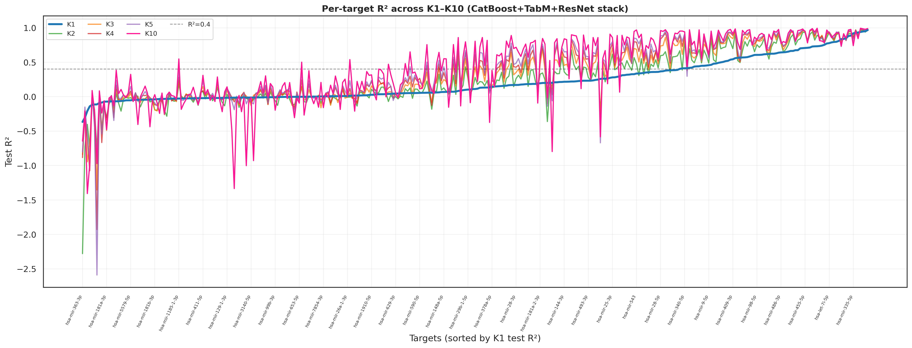

## Overview

Model performance was evaluated on 327 target miRNAs. A total of 168 targets achieved the predefined performance threshold (R² > 0.4) - eligible targets, they were selected for downstream inference.

For each target, the final prediction level was chosen as the lowest pseudobulk aggregation level (including single-cell resolution, K = 1) at which the target achieved R² > 0.4.

