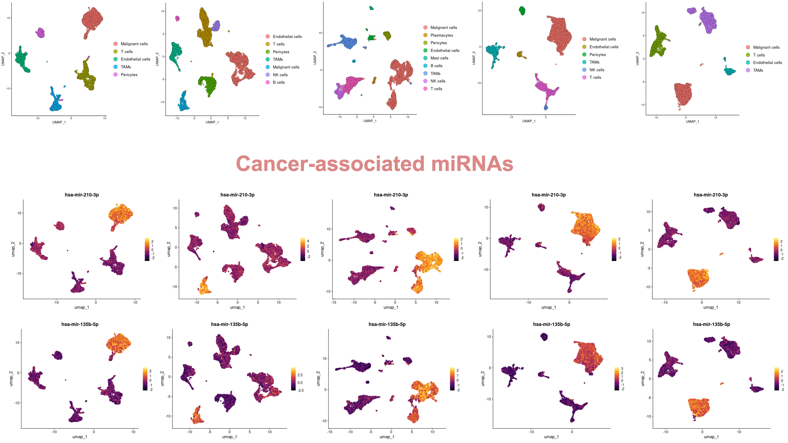
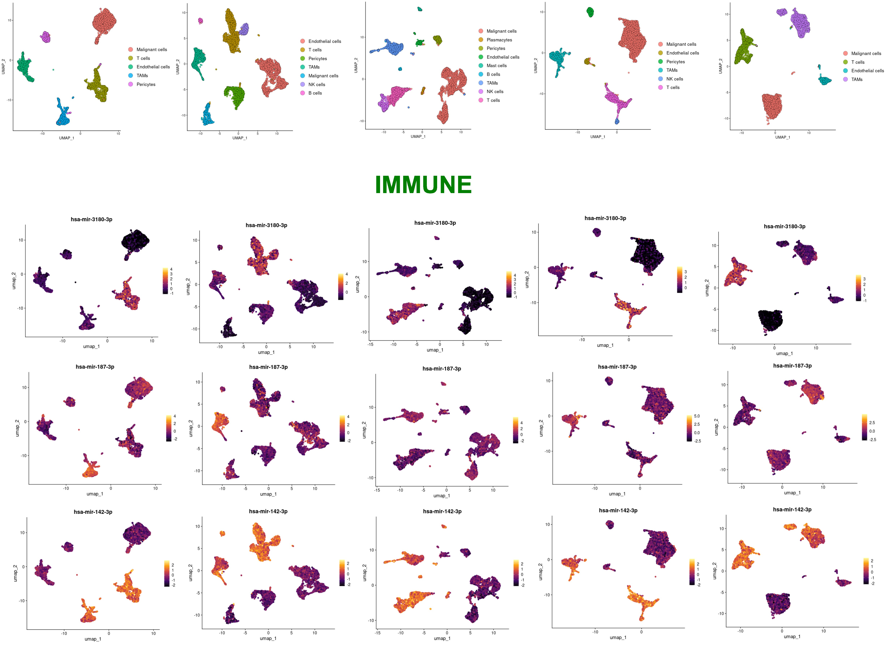
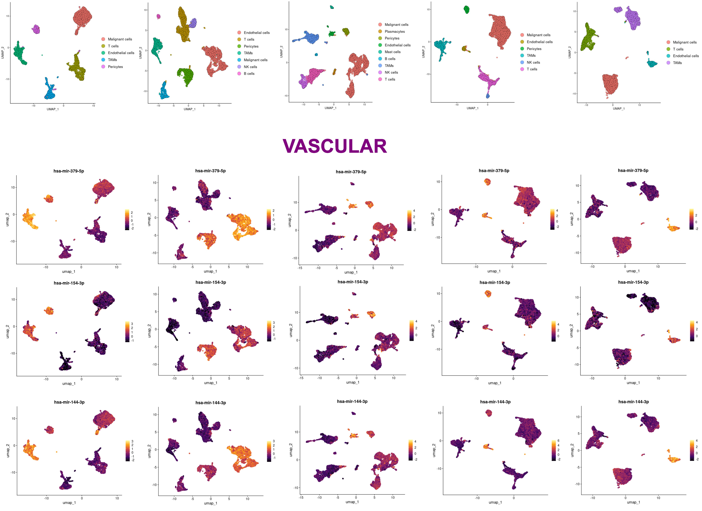

## Overview

Model performance was evaluated on 327 target miRNAs. A total of 164 targets achieved the predefined performance threshold (R² > 0.4) and were selected for downstream inference.

For each target, the final prediction level was chosen as the lowest pseudobulk aggregation level (including single-cell resolution, K = 1) at which the target achieved R² > 0.4.

## Prerequisites (not in git)

See `../../data/README.md`:

1. **Training splits** → `data/splits/` (includes KNN ref `sc_k1/X_train.parquet`)
2. **Pretrained models** → `final_train_test_inference/models/`
3. **scRNA matrices for batch inference** → `data/inference_inputs/`  
   Outputs → `data/inference_outputs/`

```bash
export PYTHONPATH=/path/to/ml_pipeline
python total_inference/total_inference.py \
  --input-dir ../../data/inference_inputs \
  --output-dir ../../data/inference_outputs
```

`SingleCell` lives in `preprocessor.py`:

```python
from preprocessor import SingleCell
```

## Repository Structure

| File | Description |
|------|-------------|
| `target_config.json` | Eligible miRNA targets (R² > 0.4), features, test metrics, optimal K |
| `stack_predictor.py` | Stacking ensemble (CatBoost + TabM + ResNet, Ridge meta-learner) |
| `preprocessor.py` | `SingleCell` pipeline (align, ENSG, pseudobulk, TPM, log) |
| `mRNA_names.json` | Reference mRNA feature list |
| `ensembl_gene_mapping.csv` | Gene symbol → ENSG map |
| `df_gene_mapping.parquet` | Gene lengths for TPM |
| `constants.py` | `INFERENCE_DIR`, `FTTI_ROOT`, `ML_PIPELINE`, I/O + model paths |
| `Inference_tutorial.ipynb` | Tutorial on five RCC snRNA-seq datasets |
| `total_inference/total_inference.py` | Batch inference over all study scRNA datasets |

**Code for single-cell data processing and plot generation:** see repo folder `scRNA_inference_data_processing/`.

KNN reference (`X_train.parquet` for K1) is also on Kaggle as `X_TRAIN_K1.parquet`:  
https://www.kaggle.com/datasets/ismailovaly/mirna-prediction-project

## Inference results (Renal cell cancer snRNA-seq examples)




