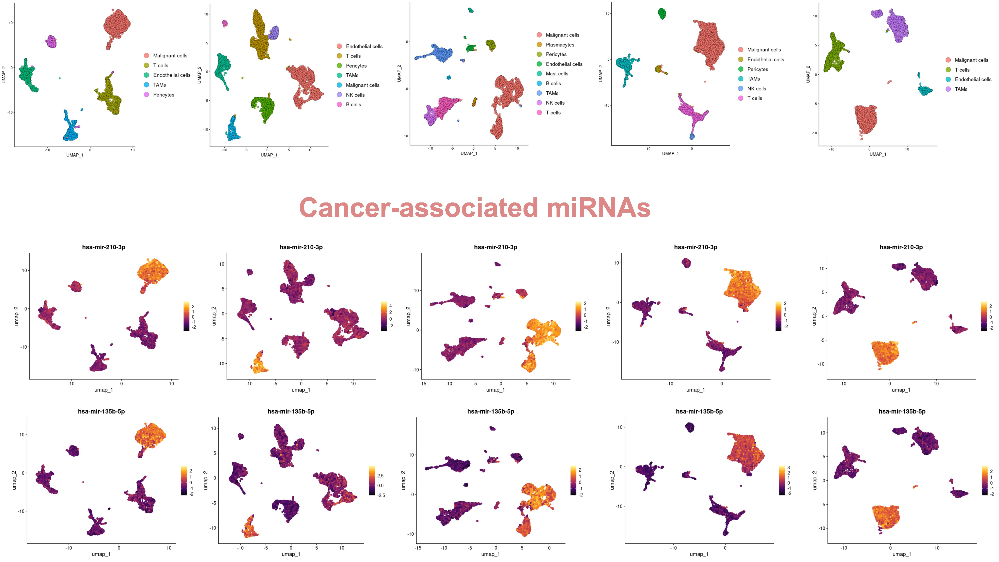
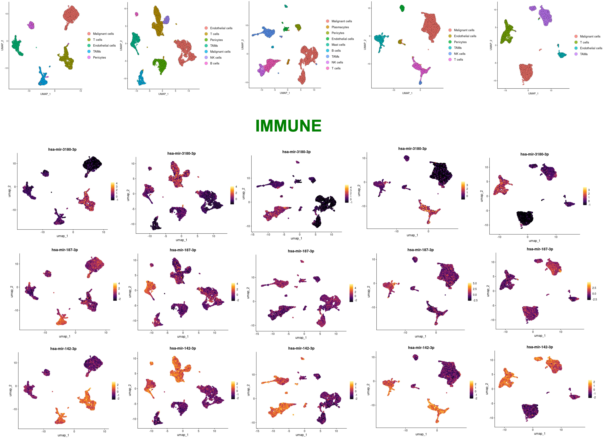
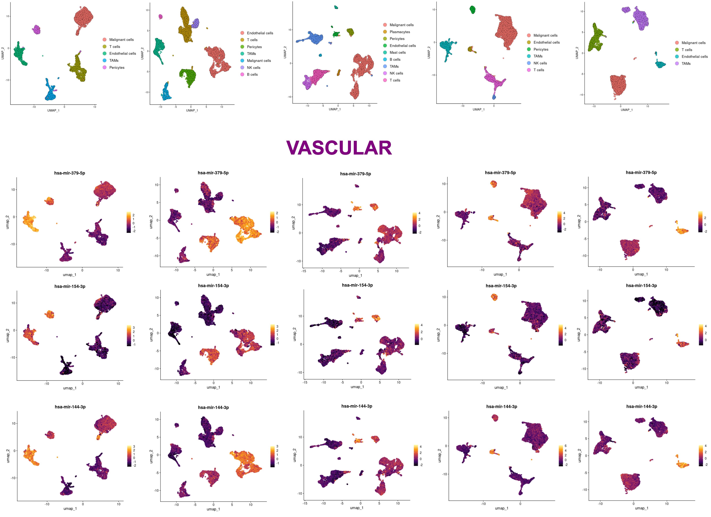

## Overview

Model performance was evaluated on 327 target miRNAs. A total of 164 targets achieved the predefined performance threshold (R² > 0.4 both on scRNA and bulk test datasets). 12 miRNAs from 164 (15 from 327) had zero expression in GTEx bulk dataset and consequently were excluded from prediction. Finally 152 targets (miRNAs) were selected for downstream inference.

## Prerequisites (not in git, available through kaggle)

See `../../data/README.md`:

1. **Training splits** → `data/splits/` (includes KNN ref `sc_k1/X_train.parquet`)
2. **Pretrained models** → `final_train_test_inference/models/`
3. **scRNA matrices for inference** → `data/inference_inputs/`  
   Outputs → `data/inference_outputs/`


`miRPredictor` — main inference class (`mirpredictor.py`):

```python
from mirpredictor import miRPredictor
import scanpy as sc

mp = miRPredictor(device="cpu")
mp.get_mirs()
mp.get_features()
mp.get_metrics(["hsa-let-7b-5p"])

pred_df = mp.predict_csv("counts.csv")   # DataFrame: cells × miRNAs
adata = sc.read_h5ad("data.h5ad")
adata = mp.predict(adata)                # AnnData with miRNA columns in .obs
# also: adata.obsm['X_mirna'], adata.uns['mirna_prediction']
```

### Conda environment

```bash
conda env create -f environment.yml
conda activate mir_inference
# TabPack (required for TabPack base model):
#   git clone https://github.com/yandex-research/tabpack /tmp/yandex_tabpack_312
export TABPACK_ROOT=/tmp/yandex_tabpack_312
export PYTHONPATH="$TABPACK_ROOT/src:$PYTHONPATH"
```

`preprocessor.py` remains a thin back-compat shim (`SingleCell` alias).

## Repository Structure

| File | Description |
|------|-------------|
| `prediction_config.json` | Eligible miRNAs, feature panels, bulk/sc R² & MSE, optimal K |
| `robustness_config.json` | Minimal SC feature sets; gates whether a miRNA can be predicted |
| `environment.yml` | Conda env `mir_inference` (scanpy, optuna, torch, xgboost, …) |
| `stack_predictor.py` | TabPack + TabM + XGB ridge stack |
| `mirpredictor.py` | `miRPredictor` (align, ENSG, KNN impute/pseudobulk, TPM, predict) |
| `preprocessor.py` | Back-compat shim → `miRPredictor` |
| `mRNA_names.json` | Reference mRNA feature list |
| `ensembl_gene_mapping.csv` | Gene symbol → ENSG map |
| `df_gene_mapping.parquet` | Gene lengths for TPM |
| `constants.py` | `INFERENCE_DIR`, `FTTI_ROOT`, `ML_PIPELINE`, I/O + model paths |
| `Inference_tutorial.ipynb` | Tutorial on five RCC snRNA-seq datasets |
| `total_inference/total_inference.py` | Batch inference over all study scRNA datasets |

**Code for single-cell data processing and plot generation:** see repo folder `scRNA_inference_data_processing/`.

KNN reference (`X_train.parquet` for K1) is also on Kaggle as `X_TRAIN_K1.parquet`:  
https://www.kaggle.com/datasets/ismailovaly/mirna-prediction-project

## Inference results (Renal cell cancer snRNA-seq examples)




