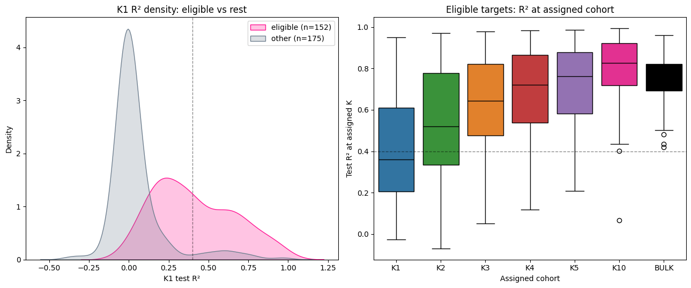
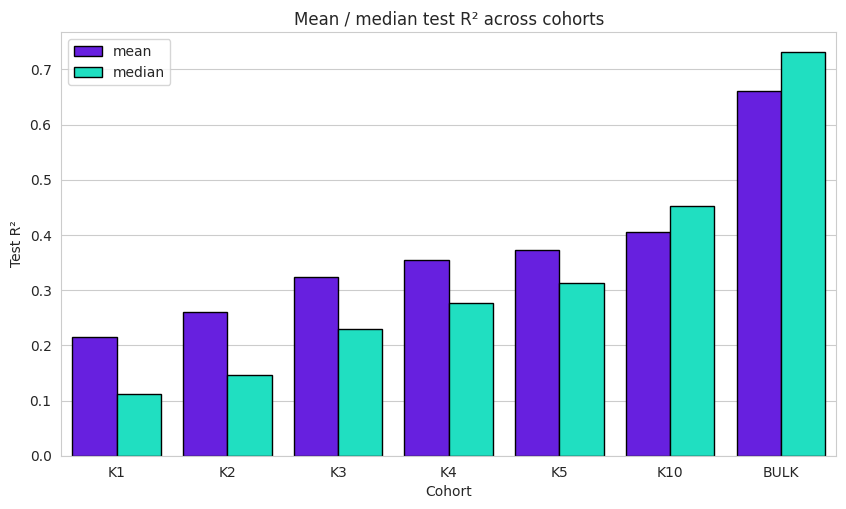
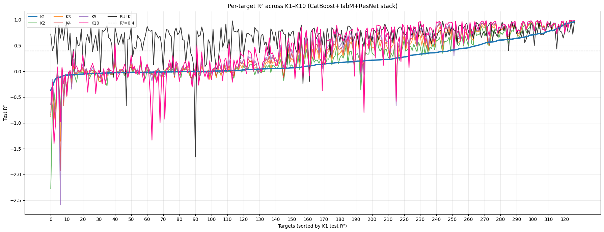
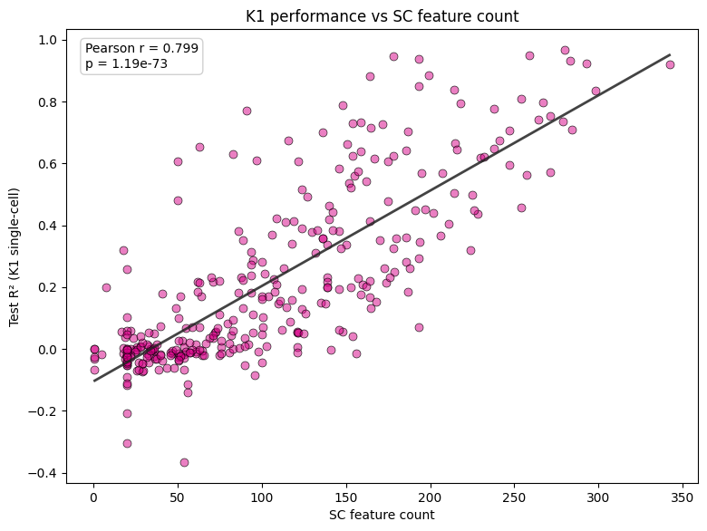

## Reproduce held-out TEST metrics

Raw TEST matrices (gitignored) live under `test_evaluating/`:

```
test_evaluating/
  bulk_TEST/   X_BULK_TEST.parquet  Y_BULK_TEST.parquet
  sc_TEST/     X_TEST_K1.parquet  Y_TEST_K1.parquet
               X_TEST_PB_K{2,3,4,5,10}.parquet (+ matching Y_*)
  evaluate_bulk_test.py
  evaluate_sc_test.py
  run_bulk_test_eval.sh
  run_sc_test_eval.sh
```

Also required:
- `../models/ensemble/catboost_tabm_resnet_stack/weights/`
- `../train/results/{catboost_optuna,tabm,resnet}/models/`
- `../../data/splits/sc_k1/X_train.parquet` (KNN ref for K1)

```bash
export PYTHONPATH=/path/to/ml_pipeline
export FINAL_DEVICE=cuda   # or cpu
cd final_train_test_inference/test_metrics/test_evaluating

# optional: smoke-test a few targets
# export FINAL_TARGETS=hsa-let-7a-5p,hsa-mir-142-3p

bash run_bulk_test_eval.sh   # → ../bulk_test_metrics.csv
bash run_sc_test_eval.sh     # → ../K1_K10_test_metrics.csv
```

Committed summary tables (already computed): `bulk_test_metrics.csv`, `K1_K10_test_metrics.csv`.

---

## Overview

Model performance was evaluated across **327 target miRNAs**.  
Only targets achieving a minimum predictive performance threshold (**R² > 0.4**) at any resolution (K = 1, 2–5, 10) or on bulk-level metrics were retained for downstream analysis.

In total, **164 miRNAs** passed this criterion and were defined as *eligible targets*.

---

## Optimal pseudobulk resolution selection

Predictive performance generally improved with increasing pseudobulk aggregation level. However, for a subset of miRNAs, performance differences between single-cell resolution (K = 1) and higher pseudobulk levels were minimal.

To balance **predictive accuracy** and **resolution granularity**, we implemented an adaptive selection strategy (see `vizualization_and_config.ipynb`):

1. For each eligible miRNA, the maximum R² across all K values was identified  
2. A tolerance threshold was defined as **−7.5% from the maximum R²**  
3. The **smallest K** satisfying this criterion was selected as the optimal resolution  

This ensures preference for higher resolution (lower K) when performance is comparable.

---

## Distribution of selected targets

Final assignment of optimal pseudobulk resolution:

- **K1 (single-cell level):** 11 targets  
- **K2:** 21 targets  
- **K3:** 18 targets  
- **K4:** 20 targets  
- **K5:** 22 targets  
- **K10:** 76 targets  

---

## Model performance summary

### Pseudobulk (optimal K selection)

- Mean R²: **0.7820**  
- Median R²: **0.8212**  
- Max R²: **0.9688**  
- Min R²: **0.4019**

### Bulk-level performance

- Mean R²: **0.7663**  
- Median R²: **0.7813**  
- Max R²: **0.9754**  
- Min R²: **0.4195**

---

## Reproducibility

The selection strategy is implemented in `vizualization_and_config.ipynb`.





# Correlation between number of selected features on single-cell and R2 perfomance on K1 (single cell level)

