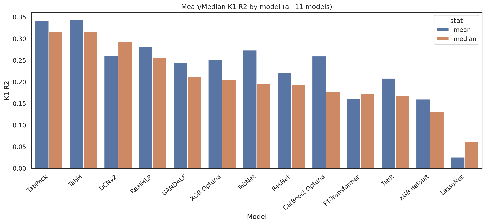
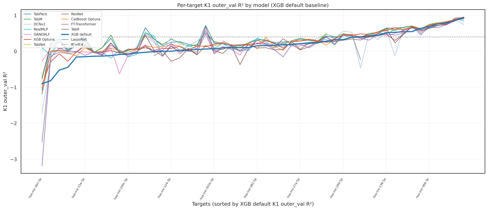

## Model Selection 

### Overview of candidates
An XGBoost model with default parameters was established as the baseline. 

1. **XGBoost** + Optuna
2. **CatBoost** + Optuna
3. **TabNet**
4. **GANDALF**
5. **TabPFN 3.0**
6. **FT-Transformer**
7. **LassoNet**
8. **TabM**
9. **ResNet-like**  
10. **RealMLP**
11. **DCNv2**

---

### Phase 1: Efficiency & Speed Benchmarking
In the initial iteration, we benchmarked the training and inference speeds of the models. We specifically focused on **TabPFN** and **FT-Transformer**, as both are notorious for computational overhead. Detailed logs and metrics of this phase are located in the `speed_test/` directory.

*   **TabPFN:** As anticipated, TabPFN exhibited prohibitive inference times that were completely incompatible with the scale of our data. Consequently, it was excluded from subsequent phases.
*   **FT-Transformer:** Although it required substantially more training time compared to the other architectures, we retained it for further evaluation. This decision was based on findings by Gorishniy et al. (arXiv:2106.11959), which demonstrated that FT-Transformer can outperform ResNet-like model on specific tabular tasks.

---

### Phase 2: Evaluation Protocol
All remaining models were systematically evaluated using the following validation pipeline:
*   **Data Composition:** Models were trained and validated using a mixed data combining **bulk RNA-seq**, **single-cell (K1)**, and **pseudobulk** data (K2, K3, K4, K5, K10) as usual.
*   **Validation Split:** Train dataset was split into inner_train and inner_validation to train models and facilitate early stopping / optimal epoch selection, respectively. Model performance was tracked using this validation set (outer_val - used as temporary test cohort).
*   **Scaler fit noise:** For DL / neural candidates that use `StandardScaler` or `QuantileTransformer`, we add N(0, 10e-5) noise (fixed seed) **only when fitting** the scaler, to avoid numerical issues from duplicate / zero-inflated feature values. 

---

### Benchmarking resutls
Based on our evaluation metrics, TabM, CatBoost and XGB models clearly outperformed the rest of the cohort. FT-Transformer achieved a better median performance than ResNet but showed worse mean performance due to several outlier predictions. Considering its high computational cost and inferior mean performance, we decided to exclude FT-Transformer from further analysis. ResNet, GANDALF, and RealMLP showed comparable mean and median performance. For downstream analysis and ensemble benchmarking, we selected ResNet as the fourth model. The top models were ranked by their mean and median $R^2$ scores on outer K1 (main cohort for comparing):

| Rank | Model | Mean $R^2$ | Model | Median $R^2$ |
| :---: | :--- | :---: | :--- | :---: |
| **1** | **TabM** | 0.2260 | **XGBoost + Optuna** | 0.1570 |
| **2** | **CatBoost + Optuna** | 0.2215 | **CatBoost + Optuna** | 0.1443 |
| **3** | **XGBoost + Optuna** | 0.2207 | **TabM** | 0.1350 |
| **4** | **ResNet-like** | 0.1940 | **FT-Transformer** | 0.1249 |

##### FIGUERS

> **Conclusion:** **TabM**, **CatBoost**, **XGBoost**, and **ResNet-like** architectures have been selected to construct advanced ensemble architectures in the next phase of the project (ensebmle benchmarking)
