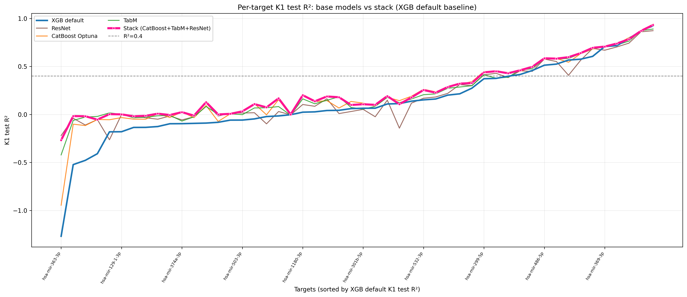
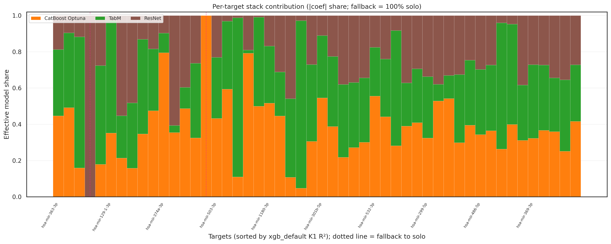

## Ensembling strategies

### Selected Base Models
For the ensembling phase, we selected the 4 top-performing architectures from the previous step (`model_selection`) that demonstrated the optimal trade-off between computational efficiency and predictive metrics:
* **CatBoost** + Optuna
* **XGBoost** + Optuna
* **TabM**
* **ResNet-like**

---

### Ensembling Approaches
We explored several blending and stacking techniques to build the combinations:
1. **Ridge Stacking:** A meta-learner (Ridge regression) trained on base model predictions.
2. **Weighted Blending:** Linear combinations of model predictions. 

$$
\text{Example (2 models): } \hat{y} = \alpha \cdot \mathrm{pred}_{\mathrm{model}_1} + (1-\alpha) \cdot \mathrm{pred}_{\mathrm{model}_2}
$$

3. **Model Soup:** Averaging weights or predictions across configurations using three distinct heuristics:
   * *Uniform Soup:* Simple unweighted average of the selected models.
   * *Greedy Soup:* Sequentially adding models only if they improve validation performance.
   * *Pruned Soup:* Evaluating the full pool and iteratively dropping underperforming candidates.

To comprehensively find the optimal combination, we evaluated **55 different ensemble configurations** by testing all possible model subsets across all 5 strategies:
$$\Big( \binom{4}{2} + \binom{4}{3} + \binom{4}{4} \Big) \times 5 = (6 + 4 + 1) \times 5 = 55 \text{ configurations}$$

---

### Results & Final Selection
The ensembles successfully pushed the performance boundary beyond any individual model. When evaluated by **median $R^2$** on outer_val K1 cohort, the top-performing combinations were:

| Rank | Ensemble Architecture | Base Models Included | Median $R^2$ | Mean $R^2$ |
| :---: | :--- | :--- | :---: | :---: |
| **1** | **Ridge Stacking** | CatBoost + TabM + ResNet | **0.1729** | **0.2492** |
| **2** | **Ridge Stacking** | CatBoost + TabM | 0.1715 | 0.2489 | 
| **3** | **Uniform Soup** | All 4 models (CatBoost + XGBoost + TabM + ResNet) | 0.1714 | 0.2487 |

> **Final Decision:** The **Ridge Stacking ensemble comprising CatBoost, TabM, and ResNet** achieved the highest median $R^2$ score of **0.1729** (outperforming the best single-model baseline of 0.1570). This architecture has been selected as our final predictive model.
