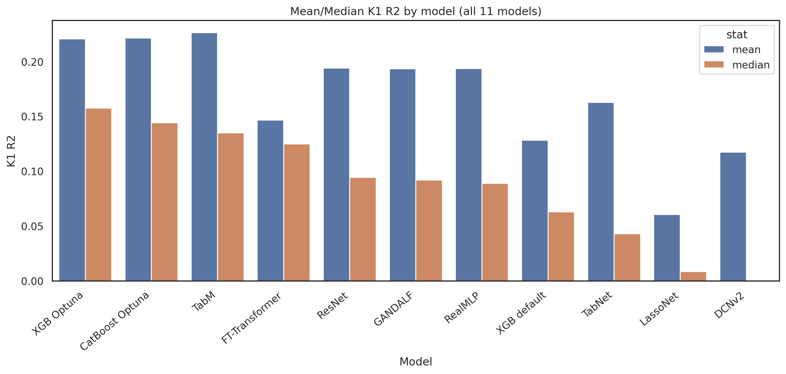

## Inputs / Run / Outputs

**Inputs**
- `../../data/splits/`
- `../../data/frozen/selected_features.json` + `selected_targets.txt`
- `../../shared/` (DL trainers)

**Run**
```bash
export PYTHONPATH=/path/to/ml_pipeline
python run_model_screen.py
```

**Outputs**
- `results/<model>/outer_val_metrics.csv` (created on run)
- committed summary: `tables/`, `figures/`

## Model Selection & Benchmarking

### Overview of Candidates
To identify the top-performing architectures for our predictive tasks, we evaluated 12 distinct models. An XGBoost model with default parameters was established as the baseline. The complete list of tested models includes:

1. **XGBoost** + Optuna
2. **CatBoost** + Optuna
3. **TabNet**
4. **GANDALF**
5. **TabPFN 3.0**
6. **FT-Transformer**
7. **LassoNet**
8. **TabM**
9. **ResNet-like** architecture
10. **RealMLP**
11. **DCNv2**

---

### Phase 1: Efficiency & Speed Benchmarking
In the initial iteration, we benchmarked the training and inference speeds of the models. We specifically focused on **TabPFN** and **FT-Transformer**, as both are notorious for computational overhead. Detailed logs and metrics of this phase are located in the `speed_test/` directory.

*   **TabPFN:** As anticipated, TabPFN exhibited prohibitive inference times that were completely incompatible with the scale of our data. Consequently, it was excluded from subsequent phases.
*   **FT-Transformer:** Although it required substantially more training time compared to the other architectures, we retained it for further evaluation. This decision was based on findings by Gorishniy et al. (arXiv:2106.11959), which demonstrated that FT-Transformers can outperform ResNet-like models on specific tabular tasks.

---

### Phase 2: Evaluation Protocol
All remaining models were systematically evaluated using the following validation pipeline:
*   **Data Composition:** Models were trained and validated using a heterogeneous dataset combining **bulk RNA-seq**, **single-cell (K1)**, and **pseudobulk** data (K2, K3, K4, K5, K10).
*   **Validation Split:** The core dataset was split into training and internal validation subsets to facilitate early stopping and optimal epoch selection. Model performance was tracked using this validation set.
*   **Held-out Test Set:** A completely separate, unseen test dataset was strictly preserved for the final evaluation phase and was not touched during this benchmarking step.

---

### Benchmarking Results & Next Steps
Based on our evaluation metrics, four models clearly outperformed the rest of the cohort. The top models were ranked by their mean and median $R^2$ scores:

| Rank | Model | Mean $R^2$ | Model | Median $R^2$ |
| :---: | :--- | :---: | :--- | :---: |
| **1** | **TabM** | 0.2260 | **XGBoost + Optuna** | 0.1570 |
| **2** | **CatBoost + Optuna** | 0.2215 | **CatBoost + Optuna** | 0.1443 |
| **3** | **XGBoost + Optuna** | 0.2207 | **TabM** | 0.1350 |
| **4** | **ResNet-like** | 0.1940 | **ResNet-like** | 0.0940 |

##### FIGUERS



> **Conclusion:** **TabM**, **CatBoost**, **XGBoost**, and **ResNet-like** architectures consistently locked in the top 4 positions across both aggregate metrics. All four models have been selected to construct advanced ensemble architectures in the next phase of the project.
