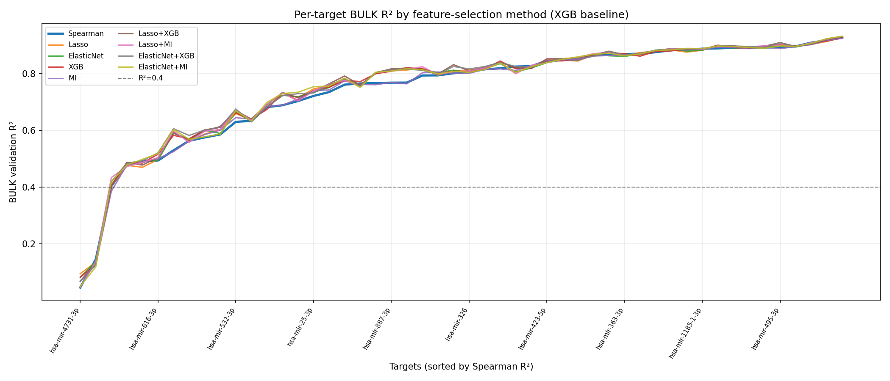
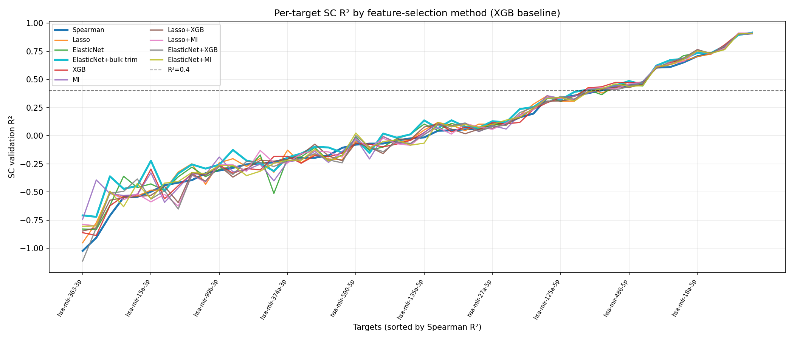

## Feature Selection 

This repository contains a scalable pipeline designed to handle a severe feature-to-sample ratio of out train data: **17k+ features** against **300+ targets** (miRNAs). 

To identify the most robust and computationally efficient feature selection strategy, we implemented a benchmarking framework using a representative subset of **50 randomly selected miRNAs** before scaling the optimal approach to the entire dataset.

### Pipeline Architecture

Every feature selection strategy in this pipeline follows a **two-step architecture** applied strictly to the training data to prevent data leakage:

1. **Step 1: Filtering (Spearman Correlation)** Select top 1500 correlated features for each miRNA
2. **Step 2: Models** The remaining features are processed through one of the following competing approaches:
   * **Baseline:** Spearman correlation selection itself.
   * Linear selection via `Lasso` and `ElasticNET` 
   * **Non-linear Alternative 1:** Feature importance from a **Shallow XGBoost** regressor.
   * **Non-linear Alternative 2:** Information-theoretic ranking via **Mutual Information (MI)** scores.
   * Pair-wise union of Linean and non-linear approaches

For each method we selected top 800 features from bulk train data and top 800 features for train K1+K2 data (pure single cell + pseudobulk size 2 samples). Final set included 800 features (preferentially from K1+K2 part) - in order to test stability of method to select features in resticted conditions
---

### Benchmarking Strategy

To evaluate and compare the performance of each selection method, we train a downstream **XGBoost Regressor** with default hyperparameters on the selected feature subsets.

### Benchmarking Results

The evaluation of the feature selection strategies revealed a tight competition between the linear methods, while non-linear approaches and their pairwise combinations significantly underperformed, particularly in terms of the performance-to-sparsity trade-off.

The final results, compiled in `table/summary.сsv`, demonstrate that **ElasticNet** and **Lasso** deliver highly comparable predictive accuracy, but with a noticeable difference in the size of the selected feature space.

#### Key Findings:

ElasticNet and Lasso were the strongest standalone selectors on the 50-miRNA pilot. Non-linear methods (XGB importance, MI) and their unions with linear selectors did not improve the performance-to-sparsity trade-off and often hurt single-cell validation.

Bulk-only post-processing (ElasticNet + bulk trim)
After the full ElasticNet run on all 327 miRNAs (stage01_full/), bulk and SC feature counts were highly imbalanced (mean ~543 bulk vs ~104 SC per target, overlap ~4). To reduce bulk-dominated noise in the final feature set without re-running selection, we added a bulk-only trimming step (stage01_bulk_trim/):

Split selected genes into SC pool (kept intact) and bulk-only set (bulk \ sc).
Rank bulk-only genes by XGB shallow importance on bulk train.
Per-target K from {50, 100, 150, 200}: pick the smallest K that keeps bulk val R² within 10% relative / 0.02 absolute of the full union, and does not decrease SC val R² vs baseline; otherwise increase K or fall back to the full bulk-only set.
Skip targets with bulk_only < 50 or baseline bulk val R² < 0.4.
On the 50-miRNA pilot (summary_by_method.csv), ElasticNet + bulk trim gave mean bulk val R² 0.747 (vs 0.750 for ElasticNet), mean SC val R² 0.084 (vs 0.049), and ~307 features (vs ~656), with 13/50 SC targets above R² = 0.4 (vs 12). Bulk performance stayed stable while SC improved and the feature space shrank by ~2×. The same procedure was applied to all 327 targets

#### Performance Visualization

The cross-target validation performance across the benchmarked configuration options is illustrated below:

##### 1. Bulk Validation Performance (`r2_by_target_bulk.png`)

*This plot displays the distribution of $R^2$ scores across the benchmarked miRNAs evaluated on bulk training data.*

##### 2. Pseudo-Single-Cell Validation Performance (`r2_by_target_sc.png`)

*This plot highlights the stability and generalization of the selection methods on the restricted `K1+K2` single-cell level data, justifying the selection of ElasticNet for scaling.*
