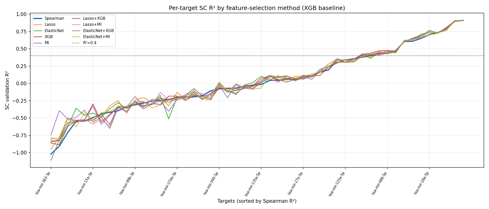

## Feature Selection 

This repository contains a scalable pipeline designed to handle a severe feature-to-sample ratio of out train data: **17k+ features** against **300+ targets** (miRNAs). 

To identify the most robust and computationally efficient feature selection strategy, we implemented a benchmarking framework using a representative subset of **50 randomly selected miRNAs** before scaling the optimal approach to the entire dataset.

### Pipeline Architecture

Every feature selection strategy in this pipeline follows a **two-step architecture** applied strictly to the training data to prevent data leakage:

1. **Step 1: Filtering (Spearman Correlation)** Select top 1500 correlated features for each miRNA
2. **Step 2: Models** The remaining features are processed through one of the following competing approaches:
   * **Baseline:** Spearman correlation selection itself.
   * Linear selection via `Lasso` and `ElasticNET` 
   * **Non-linear Alternative 1:** Feature importance from a **Shallow XGBoost** regressor.
   * **Non-linear Alternative 2:** Information-theoretic ranking via **Mutual Information (MI)** scores.
   * Pair-wise union of Linean and non-linear approaches

For each method we selected top 800 features from bulk train data and top 800 features for train K1+K2 data (pure single cell + pseudobulk size 2 samples). Final set included 800 features (preferentially from K1+K2 part) - in order to test stability of method to select features in resticted conditions
---

### Benchmarking Strategy

To evaluate and compare the performance of each selection method, we train a downstream **XGBoost Regressor** with default hyperparameters on the selected feature subsets.

### Benchmarking Results

The evaluation of the feature selection strategies demonstrated that **ElasticNet** provides the optimal trade-off between predictive performance, generalization, and feature sparsity. 

The results, compiled in `summary_by_config.csv`, reveal that ElasticNet consistently maintained high prediction accuracy while aggressively reducing the feature space to an average of **656 selected features** per target. Crucially, it outperformed pure non-linear and baseline models when transferring learned feature spaces to low-sample-size regimes.

#### Key Findings:
* **The Winner (ElasticNet):** Achieved the best performance trade-off, specifically demonstrating superior median $R^2$ scores on the `K1+K2` validation sets (pseudo-single-cell level). This success is largely driven by its $L_2$ regularization component, which stabilizes feature selection in the presence of highly correlated transcriptomic networks.
* **Model Stability:** Testing on the restricted `K1+K2` subset confirmed that ElasticNet successfully identifies robust biological signals rather than over-fitting to bulk data noise, fulfilling our core requirement for stability under restricted single-cell conditions.

#### Performance Visualization

The cross-target validation performance across different selection methods is illustrated below:

##### 1. Bulk Validation Performance (`r2_by_target_bulk.png`)

*This plot displays the distribution of $R^2$ scores across the benchmarked miRNAs evaluated on bulk data.*

##### 2. Pseudo-Single-Cell Validation Performance (`r2_by_target_sc.png`)

*This plot highlights the stability and generalization of the feature selection methods on the restricted `K1+K2` single-cell level data.*
