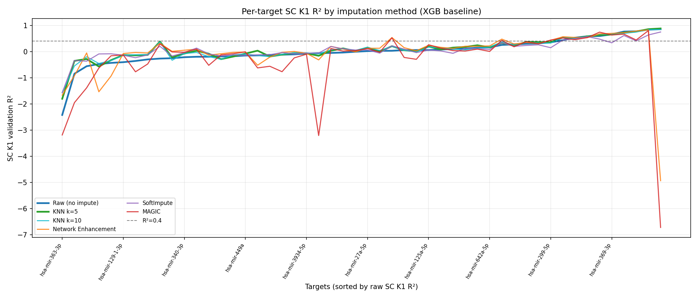
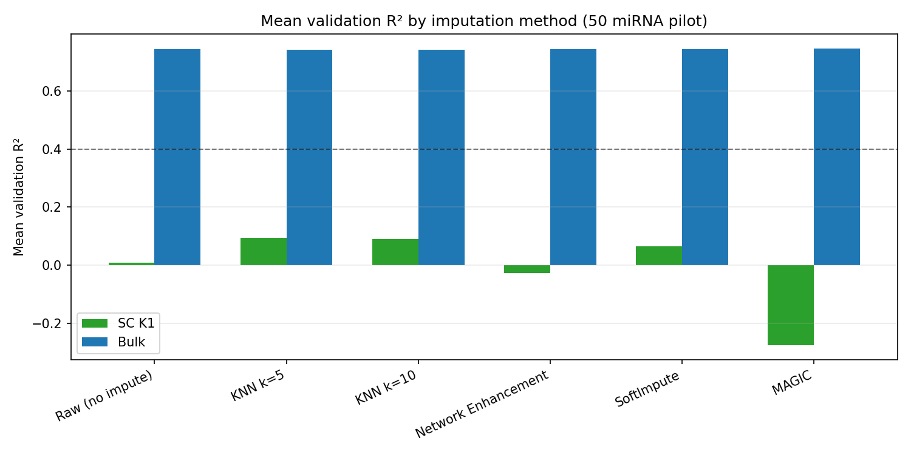

# Benchmarking Imputation Methods for Single-Cell Transcriptomics

This repository contains the pipeline and evaluation scripts for benchmarking data imputation methods on transcriptomic datasets.

## Method Comparison
The benchmark evaluated the following methods:
* **Baseline:** Raw data (No Imputation)
* **KNN 5**
* **KNN 10**
* **NE** (Network Enhancement)
* **MAGIC**
* **SoftImpute**

## Experimental Setup
* **Data Preprocessing:** Input data were normalized to log2(TPM + 1) prior to imputation.
* **Training Data:** Models were trained on a mixture of bulk, single-cell (K1), and pseudobulk (K2, K3, K4, K5, K10) data.
* **Imputation Scope:** Imputation was applied strictly to the K1 (single-cell) level.
* **Predictive Model:** XGBoost with default parameters. Early stopping and evaluation metrics were computed on validation splits.

## Results
KNN 5 achieved the highest predictive performance on the K1 validation sets (full results stored in /table directory).

* **Delta Mean Val K1:** +0.087
* **Delta Median Val K1:** +0.048
* **Statistical Significance:** p = 0.00007 (Wilcoxon signed-rank test with Bonferroni correction vs. Raw Baseline)

##### Performance figures

